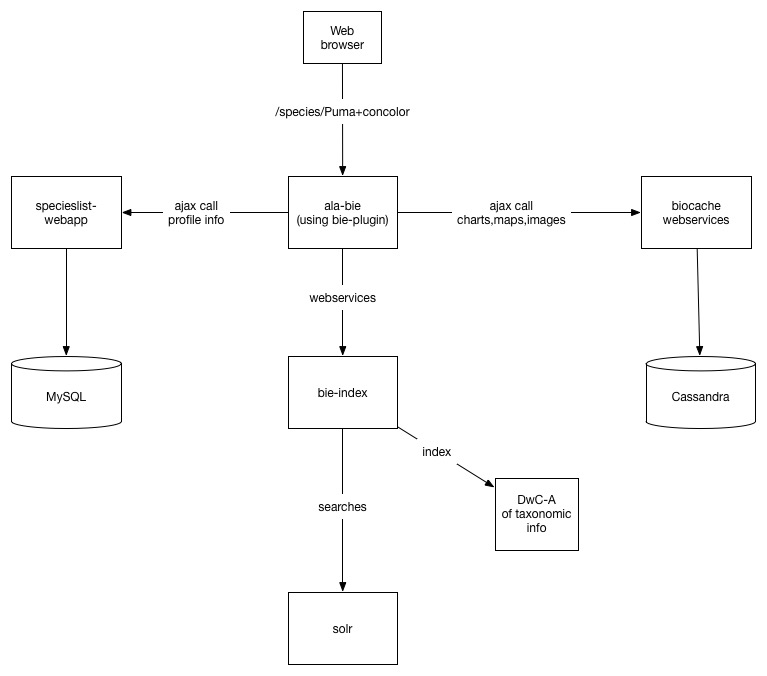

# bie-index [](https://travis-ci.org/AtlasOfLivingAustralia/bie-index)

bie-index is a grails web application that indexes taxonomic content in DwC-A and provides search web services for this content.
This includes:

- faceted taxonomic search with synonymy support
- search across other entities including:
    - regions
    - spatial layers
    - data resources
    - institutions
    - collections
- autocomplete services
- CSV download services
- bulk taxonomic lookup services by name or GUID
- retrieval of full classification (major and non-major taxonomic ranks e.g. sub-order, sub-family)
 
This project provides JSON webservices and an interface for admin users. It does not include a HTML interface for end users. 
There is a set of front end components available providing the species pages listed here:

- [bie-plugin](http://github.com/AtlasOfLivingAustralia/bie-plugin) - a grails plugin providing species pages & search interfaces
- [ala-bie](http://github.com/AtlasOfLivingAustralia/ala-bie) - the ALA version of this front end
- [generic-bie](http://github.com/AtlasOfLivingAustralia/generic-bie) - a generic version of this front end for use as a starting point for other countries reusing ALA components.

For an introduction to the approach to names within the ALA, [nameology](https://github.com/AtlasOfLivingAustralia/bie-index/blob/master/doc/nameology/index.md) is a good place to start.

## Darwin Core archive format of taxonomic information

This application currently supports the ingestion of Darwin Core archive (DwC-A) with the following mandatory darwin core fields in the core file:

- [taxonID](http://rs.tdwg.org/dwc/terms/#taxonID)
- [parentNameUsageID](http://rs.tdwg.org/dwc/terms/#parentNameUsageID)
- [acceptedNameUsageID](http://rs.tdwg.org/dwc/terms/#acceptedNameUsageID)
- [scientificName](http://rs.tdwg.org/dwc/terms/#scientificName)
- [scientificNameAuthorship](http://rs.tdwg.org/dwc/terms/#scientificNameAuthorship)
- [taxonRank](http://rs.tdwg.org/dwc/terms/#taxonRank)

Additional fields can be added which will allow more sophisticated handling of names

- [nameComplete](http://ala.org.au/terms/1.0/nameComplete) An explicit complete name. If not specified, the scientificNameAuthorship (if present) is appended to the scientificName to make the canonical name.
- [nameFormatted](http://ala.org.au/terms/1.0/nameFormatted) An explicitly formatted name, with name, author and structural parts marked by `<span class="...">` elements. If not explicitly present, it is constructed from the information available. See [Name Formatting](doc/nameology/name-formatting.md) for details.

Additional fields added to the core file e.g. establishmentMeans or any other field will also be indexed and available for facetted searching.

An extension file of vernacular names is also supported.
The format support here aligns with the same format supported by the [ala-names-matching API](https://travis-ci.org/AtlasOfLivingAustralia/ala-name-matching).

Additional fields , which will allow more sophisticated handling of vernacular names are:

- [status](http://ala.org.au/terms/1.0/status) An indicator of the relative importance of the vernacular name. The controlled vocabulary is read from [vernacularNameStatus.json](grails-app/config/vernacularNameStatus.json)
- [source](http://purl.org/dc/terms/source) A URL for a source of the vernacular name. This can be used to link to a page containing the original data.

An extension file of additional identifiers is also supported.
The format aligns with the [GBIF identfier](http://rs.gbif.org/terms/1.0/Identifier) format.

Additional fields, which will allow more sophisticated handling of identifiers are:

- [status](http://ala.org.au/terms/1.0/status) An indicator of the relative importance of the identifier. The controlled vocabulary is read from [identifierStatus.json](grails-app/config/identifierStatus.json)
- [source](http://purl.org/dc/terms/source) A URL for a source of the identifier. This can be used to link to a page containing the original data.

If the Darwin Core Archive contains an `eml.xml` metadata file, and no dataset name is directly supplied, the dataset name is taken from the dataset title.

### Basic example meta.xml

Below is an example meta.xml that would be provided in a darwin core archive.

```xml
<archive xmlns="http://rs.tdwg.org/dwc/text/" metadata="eml.xml">
  <core encoding="UTF-8" fieldsTerminatedBy="," linesTerminatedBy="\n" fieldsEnclosedBy="&quot;" ignoreHeaderLines="1" rowType="http://rs.tdwg.org/dwc/terms/Taxon">
    <files>
      <location>taxon.csv</location>
    </files>
    <id index="0" />
    <field term="http://rs.tdwg.org/dwc/terms/taxonID"/>
    <field index="1" term="http://rs.tdwg.org/dwc/terms/parentNameUsageID"/>
    <field index="2" term="http://rs.tdwg.org/dwc/terms/acceptedNameUsageID"/>
    <field index="3" term="http://rs.tdwg.org/dwc/terms/scientificName"/>
    <field index="4" term="http://rs.tdwg.org/dwc/terms/scientificNameAuthorship"/>
    <field index="5" term="http://rs.tdwg.org/dwc/terms/taxonRank"/>
  </core>
  <extension encoding="UTF-8" fieldsTerminatedBy="," linesTerminatedBy="\n" fieldsEnclosedBy="&quot;" ignoreHeaderLines="1" rowType="http://rs.gbif.org/terms/1.0/VernacularName">
    <files>
      <location>vernacular.csv</location>
    </files>
    <coreid index="0" />
    <field term="http://rs.tdwg.org/dwc/terms/taxonID"/>
    <field index="1" term="http://rs.tdwg.org/dwc/terms/vernacularName"/>    
  </extension>
</archive>
```

## Example archives

- UK Species inventory


## Integration points

In addition to indexing the content of the darwin core archive, the ingestion & index creation (optionally) indexes data from the following ALA components. It does this by harvesting JSON feeds from the listed components.

- Layers & regions - http://spatial.ala.org.au/layers - spatial layers available in the system and regions (e.g. states, countries)
- Collectory - http://collections.ala.org.au - data resource, collections, institutions
- Lists and traits - http://lists.ala.org.au - conservation lists, sensitive species lists, traits
- Biocache services - http://biocache.ala.org.au/ws - images, occurrence record counts

## Architecture

This application makes use of the following technologies

- Apache SOLR 4.10.x
- Grails 2.4.x
- Tomcat 7 or higher
- Java 7 or higher



## Handling URLs as taxon IDs

Some taxonIDs are now URLs, rather than LSIDs.
When provided to the server un-encoded, everything is fine.
However, if encoded with slashes being replaced by `%2F` then tomcat treats this as a security error and
returns a 400 error.
To allow encoded slashes in tomcat, start the server with `-Dorg.apache.tomcat.util.buf.UDecoder.ALLOW_ENCODED_SLASH=true`
